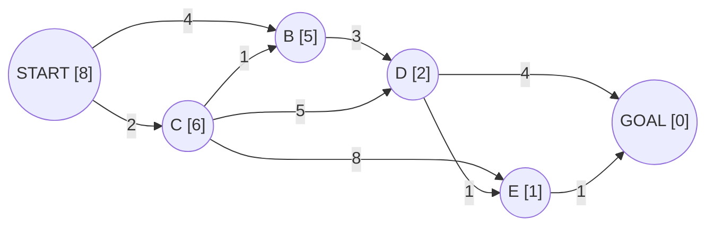
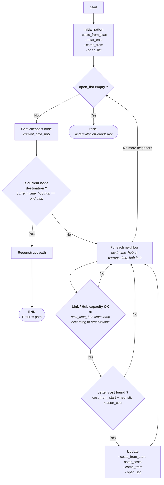
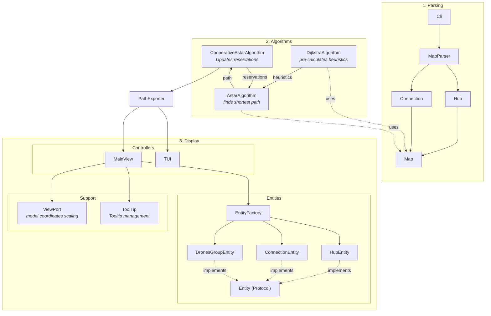

*This project has been created as part of the 42 curriculum by arebilla.*


# Fly-in: Multi-Agent Drone Routing System

<p align="center">
  <a href="https://www.python.org">
    
  </a>
  <a href="https://github.com/antoine71/42-fly-in/actions/workflows/python-app.yml">
    
  </a>
</p>

<p align="center">
  <b>Autonomous multi-agent drone routing simulator</b><br/>
  Optimize the movement of a fleet of drones across a constrained network with minimal turns.
</p>


## Description
**Fly-in** is an autonomous drone routing simulator designed to navigate a fleet of drones through a complex network of zones. The primary goal is to move all drones from a `start_hub` to an `end_hub` in the minimum number of simulation turns while strictly adhering to movement constraints, zone capacities, and link capacities.

The system handles various zone types:
- **Normal**: Standard movement (1 turn).
- **Restricted**: High-security zones requiring 2 turns to traverse.
- **Priority**: Preferred paths for the routing algorithm.
- **Blocked**: Inaccessible obstacles.


## Instructions

### Prerequisites
- Python 3.14 or later
- `uv` (recommended) or `pip`

### Installation
The project uses `uv` for dependency management. You can install everything using the provided `Makefile`:

```bash
make install
```

### Execution
To run the simulation with a specific map:
```bash
make run ARGS="tests/maps/medium/03_priority_puzzle.txt"
```
or
```bash
uv run fly-in tests/maps/medium/03_priority_puzzle.txt
```

### Linting and Testing
To ensure code quality and type safety:
```bash
make lint        # Runs flake8 and mypy
make lint-strict # Runs flake8 and mypy --strict
make test        # Runs pytest suite
```

## Algorithm & Implementation Strategy

### Cooperative pathfinding: Space-Time A*
Cooperative Pathfinding is a multi-agent path planning problem where agents must find non-colliding routes to separate destinations, given full information about the routes of other agents.

**Space-Time A-star (aka Cooperative A-star)** is an algorithm for solving the Cooperative Pathfinding problem. The task is decoupled into a **series of single agent searches**. The individual searches are performed in three dimensional space-time, and take account of the planned routes of other agents. Each vertice of the graph include a loop that **enable the agents to remain stationary**. After each agent’s route is calculated, the states along the route are marked into a reservation table. Entries in the reservation table are considered impassable and are avoided during searches by subsequent agents. The reservation table takes into account maximum hub (vertice) capacity, and maximum link (edge) capacity.


*Two units pathfinding cooperatively (illustration from Cooperative Pathfinding - David silver)*

The algorithm implements the following features:
- **Space time map**: Unlike a classical astar algorithm, the space time graphe adds a temporal component to the graph:

```python
@dataclass(frozen=True)
class TimeHub:
    hub: Hub
    timestamp: int


@dataclass(frozen=True)
class TimeConnection:
    connection: frozenset[Hub]
    timestamp: int

```
- **Conflict Avoidance**: By tracking reservations in a 3D grid (Node-Time and Edge-Time), the algorithm prevents collisions before they happen.

```python
hub_reservations: dict[TimeHub, int]
link_reservations: dict[TimeConnection, int]
```

These dictionnary structures allow the algorithm to track how much drones occupy each node and vertice at each turn.

- **Heuristic**: A pre-computed **Dijkstra** map from the destination to all nodes is used to provide a perfect spatial distance estimate, from any not to the end, significantly speeding up the A* search. This heuristic function is **admissible**: it never overstimates the cost of reaching the goal. In these condition, astar is guaranteed to return an optimal solution for each individual drone.


*Illustration of the dijkstra algorithm applied to a weighted graph: the algorithm calculates the shortest distance from A to each node of the graph.*

The activity diagram below illustrates the operational flow of the Astar algorithm, highlighting the pathfinding logic and constraint validation (hub and links capacity).



## Visual Representation
The project features a dual feedback system:
1.  **Terminal UI (Rich)**: A clean, formatted output in the terminal showing the step-by-step movements and final turn count.


2.  **Graphical Interface (Arcade)**: A 2D visualization that renders the network, zone types (with specific colors), and real-time drone movement animations. This helps in debugging complex congestion patterns and understanding the "flow" of the fleet.


This interface include user friendly interface: 
- tooltips to display drones / hubs / links information on mouse over.
- slider with mouse of keyboard (left / right arrows) controls to manually navigate through the simulation.

<table>
  <tr>
    <td align="center" width="50%">
      <br>
      <em>Tooltips</em>
    </td>
    <td align="center" width="50%">
      <br>
      <em>Slider and buttons</em>
    </td>
  </tr>
</table>

## Architecture
The projects uses a modular OOP architecture, decoupling **parsing**, **pathfinding algorithms** and **UI / Rendering logic** display.




## Resources & AI Usage
- **Algorithms**: 
    - Introduction to algorithms / Thomas H. Cormen, Charles E. Lierson, Ronald L. Rivest, Clifford Stein
    - [A* search algorithm - Wikipedia](https://en.wikipedia.org/wiki/A*_search_algorithm)
    - [Cooperative pathfinding - David Silver](https://cw.fel.cvut.cz/b211/_media/courses/b3m33mkr/coop-path-aiwisdom.pdf)

- **Libraries**: 
    - `Pydantic` for strict data validation and type safety.
    - `Arcade` for the graphical rendering engine.
    - `Rich` for enhanced terminal output.

- **AI Usage**: 
    - AI was used as a **pair-programmer** to help design the cooperative pathfinding algorithm, and to perform code reviews.

