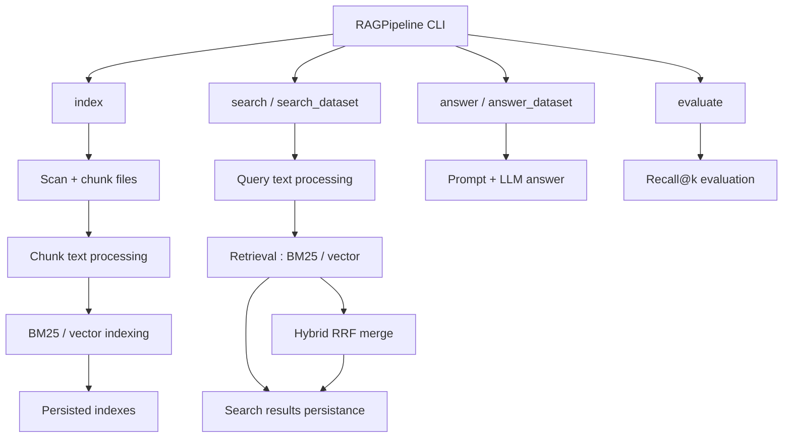
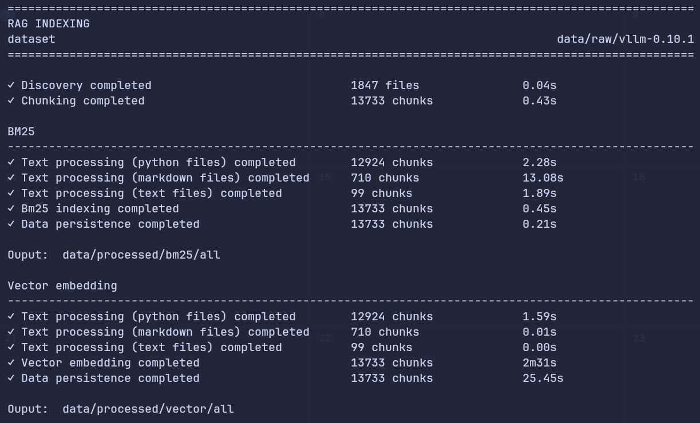
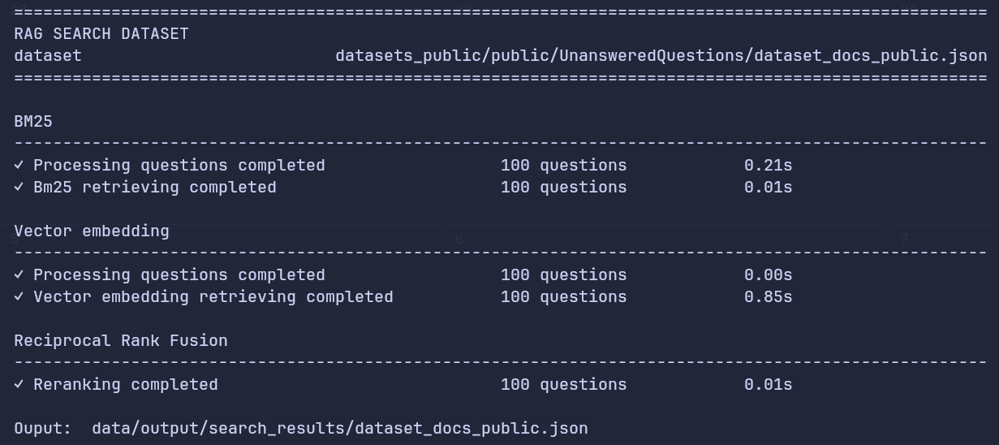

*This project has been created as part of the 42 curriculum by arebilla.*

# RAG against the machine

<p align="center">
  <a href="https://www.python.org">
    
  </a>
  <a href="https://github.com/antoine71/42-rag-against-the-machine/actions/workflows/python-app.yml">
    
  </a>
</p>

<p align="center">
  <b>A command-line Retrieval-Augmented Generation pipeline for repository QA.</b><br/>
  Index a codebase, retrieve relevant sources, generate answers, and evaluate recall.
</p>

## Description

**RAG against the machine** is a Python CLI application that builds a
Retrieval-Augmented Generation pipeline over a local repository. It was built
for the 42 RAG subject and targets the `vLLM` repository by default.

The pipeline can:

- scan and index `.py`, `.md`, and `.txt` files;
- split files into overlapping chunks;
- build BM25, vector, or hybrid indexes;
- retrieve source spans for one question or a dataset of questions;
- generate answers with a local Hugging Face causal LLM;
- evaluate retrieval quality with Recall@1, Recall@3, Recall@5, and Recall@10.

The JSON outputs follow the expected subject structures:
`StudentSearchResults` and `StudentSearchResultsAndAnswer`.

## Architecture



The architecture is modular: `RAGPipeline` only orchestrates the CLI commands,
while scanning, chunking, indexing, retrieving, LLM generation, and evaluation
are implemented as separate processors. Factories select the concrete BM25,
vector, or hybrid components from the `indexing_method` option.

The indexing pipeline scans supported files, splits them into chunks, keeps
source metadata and character spans, then builds one or more persisted indexes.
In `hybrid` mode, both BM25 and vector indexes are created from independent
copies of the same chunks.

The retrieving pipeline applies query processing, loads the matching persisted
index, and returns top-k source spans. Hybrid retrieval runs BM25 and vector
retrieval independently with extra candidates, then merges their rankings with
Reciprocal Rank Fusion.

Text processing is configuration-driven and backend-specific:
`CodeCleaningProcessor` expands code identifiers, `LemmatizationProcessor`
improves lexical matching for documentation, and `FilePathExpansionProcessor`
adds path breadcrumbs to chunks so file and directory names become searchable
context.

## Repository Layout

```text
src/rag/
├── chunking/        File splitting and source metadata
├── config/          BM25, embedding, chunking, LLM, and RRF settings
├── evaluation/      Recall metric implementation
├── indexing/        BM25 and vector index creation
├── llm/             Prompt generation and local LLM inference
├── models/          Pydantic models for datasets and outputs
├── pipeline/        Python Fire CLI entry point
├── retrieving/      BM25, vector, and hybrid retrieval
├── text_processing/ Query and chunk preprocessing
└── utils/           File IO, validation, timing, and RRF helpers
```

## Supported Data

The scanner indexes non-empty files from these categories:

| Category | Extensions |
|----------|------------|
| `code` | `.py` |
| `documentation` | `.md`, `.txt` |
| `all` | `.py`, `.md`, `.txt` |

The default repository is:

```text
data/raw/vllm-0.10.1
```

## Chunking

Files are split with LangChain recursive text splitters. Markdown uses a
dedicated `MarkdownChunkingProcessor`; Python and plain text use
`RecursiveCharacterTextSplitter`.

Default chunking settings:

| Setting | Default |
|---------|---------|
| `max_chunk_size` | `2000` characters |
| overlap ratio | `20%` |
| computed overlap | `max_chunk_size * 0.2` |

Each chunk stores source metadata, including the file path and character
indexes. Chunks are also enriched with path-derived breadcrumbs to improve
retrieval.

## Indexing and Retrieval

The same CLI option, `indexing_method`, selects the index or retriever:

| Method | Behavior |
|--------|----------|
| `bm25` | Sparse keyword index with `bm25s` |
| `vector` | Dense embeddings stored in persistent ChromaDB collections |
| `hybrid` | BM25 and vector indexes/retrievers combined |

BM25 uses `k1=1.2` and `b=0.75`.

Vector search uses:

```text
sentence-transformers/msmarco-bert-base-dot-v5
```

Hybrid retrieval runs BM25 and vector retrieval independently, asks each
retriever for `k * 4` candidates, then merges the ranked lists with Reciprocal
Rank Fusion. BM25 currently uses weight `1.9`; vector retrieval uses weight
`1.0`.

## Answer Generation

Answer generation loads a local Hugging Face causal language model through
`transformers`.

Default LLM settings:

| Setting | Default |
|---------|---------|
| model | `Qwen/Qwen3-0.6B` |
| batch size | `1` |
| max new tokens | `256` |

The model runs on CUDA when available, otherwise on CPU. The first run may
download model weights from Hugging Face.

## Performance Analysis

Evaluation compares retrieved sources against the answered-question ground
truth dataset.

A retrieved source is considered a hit when:

- it points to the same file as a ground-truth source;
- its character span overlaps the ground-truth span by at least `5%`.

The evaluator reports:

- data validity;
- number of evaluated questions;
- number of questions with reference sources;
- number of questions with retrieved sources;
- Recall@1, Recall@3, Recall@5, and Recall@10.

Current public-dataset results produced by the existing search outputs are:

| Dataset | Recall@1 | Recall@3 | Recall@5 | Recall@10 |
|---------|----------|----------|----------|-----------|
| docs | 0.660 | 0.790 | 0.860 | 0.920 |
| code | 0.410 | 0.700 | 0.750 | 0.850 |

These results satisfy the subject thresholds of Recall@5 >= 0.80 for docs and
Recall@5 >= 0.50 for code.

## Instructions

### Requirements

- Python `3.10`
- [`uv`](https://docs.astral.sh/uv/)
- Internet access for the initial dependency/model downloads
- Optional CUDA-capable GPU for faster embeddings and answer generation

### Installation

```bash
make install
```

Equivalent direct command:

```bash
uv sync
```

The Makefile runs commands with `.env.hf` when using `make run`. This is useful
for Hugging Face-related environment variables.

### CLI Usage

Run through the Makefile:

```bash
make run ARGS="<command> [options]"
```

Or call the installed script directly:

```bash
uv run --env-file=.env.hf rag <command> [options]
```

### 1. Build an index

```bash
uv run --env-file=.env.hf rag index \
  --repository data/raw/vllm-0.10.1 \
  --save_directory data/processed \
  --max_chunk_size 2000 \
  --indexing_method hybrid \
  --files_category all
```

Defaults:

```text
repository=data/raw/vllm-0.10.1
save_directory=data/processed/
max_chunk_size=2000
indexing_method=bm25
files_category=all
```

Example output:



### 2. Search one question

```bash
uv run --env-file=.env.hf rag search \
  --query "How does vLLM handle continuous batching?" \
  --index_directory data/processed \
  --indexing_method hybrid \
  --files_category documentation \
  --k 10
```

### 3. Search a dataset

```bash
uv run --env-file=.env.hf rag search_dataset \
  --dataset_path datasets_public/public/UnansweredQuestions/dataset_docs_public.json \
  --index_directory data/processed \
  --save_directory data/output/search_results \
  --indexing_method bm25 \
  --files_category documentation \
  --k 10
```

The output file keeps the input dataset filename and is written under
`save_directory`.

Example output:



### 4. Generate an answer for one question

```bash
uv run --env-file=.env.hf rag answer \
  --query "What is PagedAttention?" \
  --index_directory data/processed \
  --indexing_method hybrid \
  --files_category all \
  --k 10
```

### 5. Generate answers from search results

```bash
uv run --env-file=.env.hf rag answer_dataset \
  --student_search_result_path data/output/search_results/dataset_docs_public.json \
  --save_directory data/output/search_result_and_answer \
  --k 10
```

### 6. Evaluate retrieval

```bash
uv run --env-file=.env.hf rag evaluate \
  --student_answer_path data/output/search_results/dataset_docs_public.json \
  --dataset_path datasets_public/public/AnsweredQuestions/dataset_docs_public.json
```

### Development Commands

```bash
make test         # run pytest
make lint         # run flake8 and mypy
make lint-strict  # run flake8 and mypy --strict
make clean        # remove Python caches and tool caches
```

## Design Decisions

- BM25 remains strong for repository QA because many questions contain exact
  API names, file names, and code identifiers.
- Vector search adds semantic matching, but it is more expensive and depends on
  the embedding model quality.
- Hybrid search combines both approaches with Reciprocal Rank Fusion and is
  the most flexible mode when indexing time and storage are acceptable.
- The implementation favors explicit processors and factories so new indexing
  or retrieval strategies can be added without rewriting the full pipeline.

## Challenges Faced

- Selecting the right retrieval stack required comparing simple lexical search
  with semantic embeddings while keeping the subject performance constraints in
  mind.
- Chunking had to preserve useful source locations while still producing chunks
  small enough to fit retrieval and LLM context limits.
- Dense retrieval improves semantic matching but increases indexing time,
  storage, and model-download requirements, so hybrid mode is kept optional.
- Design a modulable application architecture with clear separation of concerns
  to allow adding new text processing capabilities, indexing or retrieving 
  stragegies without rewriting the application.

## AI Usage

AI assistance was used during the project for architecture brainstorming, code
review, docstring drafting, and README structuring. Generated suggestions were
reviewed, adapted, and tested before integration.

## Resources

- [RAG: augmenter un LLM avec vos donnees - Stephane Robert](https://blog.stephane-robert.info/docs/developper/programmation/python/rag-introduction/)
- [Speech and Language Processing, Chapter 11: Information Retrieval and Retrieval-Augmented Generation](https://web.stanford.edu/~jurafsky/slp3/)
- [bm25s](https://github.com/xhluca/bm25s)
- [ChromaDB](https://docs.trychroma.com/)
- [sentence-transformers](https://www.sbert.net/)
- [LangChain text splitters](https://python.langchain.com/docs/concepts/text_splitters/)
